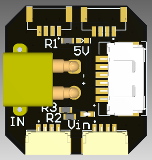
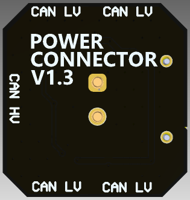

# DroneCAN/Cyphal kNode

## Doc

- [User manual](https://innopolisaero.github.io/inno_uavcan_node_binaries/guide/gps_mag_baro/)
- [Hardware docs](doc/doc.pdf)

## TERMS OF USAGE / LICENCE

The material provided in this Github repository is subject to the following conditions. 

Firmware files: All firmwares are free (but not open source). Besides unlimited private use you are also granted the permission to use them for commercial purposes under the condition that (1) you don’t modify the firmware, e.g. remove or change copyright statements, (2) provide it for free, i.e. don’t charge any explicit or implicit fees to your customers, and (3) correctly and clearly cite the origin of the firmware and the project web page in any product documentation or web page. 

Hardware files: All hardware, for which material is provided, is open source hardware, under the terms of the TAPR Open Hardware License as published by the Free Hardware Foundation, see http://www.tapr.org/ohl.html. The TAPR license explicitly permits essentially unlimited commercial use, with only few conditions such as that copyright logos are not removed.
